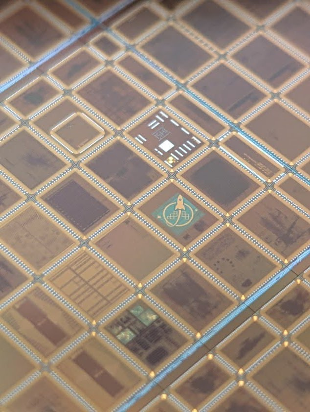
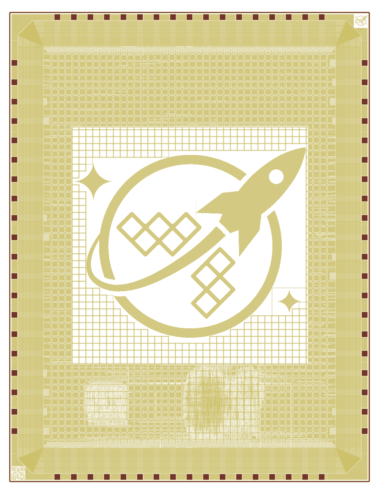

# ws-logo-die — wafer.space Logo Die

> **WSLG · Slot 1×1 · GF180MCU · wafer.space Run 1**
>
> *"Die with a big wafer.space logo on it!"*

A 1×1 slot tapeout for [wafer.space](https://wafer.space/) Run 1 (shuttle G801,
GlobalFoundries 180nm MCU). The core of the die is a giant wafer.space logo
drawn directly into the back-end-of-line metal stack, surrounded by a fully
populated I/O pad ring. The star of the show is the logo itself, but the
chip is genuinely functional: `chip_core` instantiates an 8-bit
microcontroller (QCPU) and a hardened wafer.space VGA screensaver macro,
and `input[7]` picks which of the two drives the pad ring at boot.

<div align="center">
  
  <br/><sub>The fabricated WSLG die — the rocket-and-rings logo is clearly visible<br/>on the silicon, on the wafer.space Run 1 GF180MCU wafer.</sub>
</div>

<br/>

<div align="center">
<table width="100%">
<tr>
<td width="50%" align="center">
  
  <br/><sub>GDS render in the wafer.space two-tone style<br/>(Metal5 in yellow, Pad layer in dark red)</sub>
</td>
<td width="50%" align="center">
  
  <br/><sub>Pad diagram from <a href="https://github.com/mithro/wafer-space-die-pad-diagrams">mithro/wafer-space-die-pad-diagrams</a><br/>(74 labelled pads, 3932 × 5122 µm)</sub>
</td>
</tr>
</table>
</div>

The chip is project **WSLG** on the [ws-run1 reticle](https://github.com/wafer-space/ws-run1).

## What's on the die

| Macro | Role |
|---|---|
| `big_logo` | The wafer.space logo, drawn across **all metal layers** (`Metal1`–`Metal5` plus contacts/vias). Dominates the core area. Generated from `big_logo/wafer_space_logo.png` via `ip/gf180mcu_ws_ip__logo/script/make_gds.py`. |
| `gf180mcu_ws_ip__id` | Chip ID / QR code stamp — required for tapeout, in the SW corner. |
| `gf180mcu_ws_ip__logo` | Smaller wafer.space logo template cell — auto-anchored to the NE corner via `expr::$DIE_AREA[2] - 169.25`. |
| `wrapped_vga` | Hardened VGA screensaver macro from [TinyTapeout/tt-waferspace-vga-screensaver](https://github.com/TinyTapeout/tt-waferspace-vga-screensaver), built separately under `vga_screensaver/`. |
| `chip_core` | Mode-mux around `wrapped_qcpu` (an 8-bit accumulator-style microcontroller with 128-byte SRAM, SPI-ROM boot, three GPIO ports, UART, SPI master, PWM and toggle outputs) and the VGA macro. `input[7]` selects which one drives the bidirectional pad ring; the unselected block is held in reset. |

## Pinout (1×1 slot)

The pad ring is fully populated for the wafer.space breakout PCB, but only
the pads listed below are actually consumed by the design. Anything not
mentioned (extra signal pads, the analog pads) is bonded out but has no
internal connection.

`input[7]` selects the operating mode:

| `input[7]` | Mode | Active block |
|---|---|---|
| `0` (default after reset) | **VGA screensaver** | `wrapped_vga` runs; QCPU is held in reset |
| `1` | **QCPU** | `wrapped_qcpu` runs; the VGA macro is held in reset |

### Always connected

| Pad | Signal | Notes |
|---|---|---|
| `clk_PAD` | Chip clock | Schmitt-trigger input (`gf180mcu_fd_io__in_s`) |
| `rst_n_PAD` | Active-low reset | Plain CMOS input (`gf180mcu_fd_io__in_c`) |
| `input[7]` | Mode select | Also fans out to `qcpu.PIND[7]` and `wrapped_vga.inputs[3]` |

### VGA mode (default) — useful pads

| Pad(s) | Signal | Notes |
|---|---|---|
| `input[10:4]` | `wrapped_vga.inputs[6:0]` | 7-bit control input to the screensaver |
| `bidir[39:32]` | `vga_outputs[7:0]` | 8-bit VGA output; OE forced high in this mode |

### QCPU mode — useful pads

QCPU is an 8-bit accumulator-style microcontroller that boots from an
external SPI flash. Each of the 40 bidirectional pads carries a specific
function:

| Pad(s) | Signal | Function |
|---|---|---|
| `bidir[3:0]` | `ROM_DI` / `ROM_DO[3:0]` | SPI-ROM data, quad-mode capable |
| `bidir[4]` | `CS_ROM` | SPI-ROM chip select (active low) |
| `bidir[5]` | `SCLK_ROM` | SPI-ROM clock |
| `bidir[13:6]` | `PORTA[7:0]` | GPIO port A with per-bit DDR (`PORTA_DDR`) |
| `bidir[21:14]` | `PORTB[7:0]` | GPIO port B with per-bit DDR (`PORTB_DDR`) |
| `bidir[22]` | `txd` | UART transmit |
| `bidir[23]` | `rxd` | UART receive |
| `bidir[24]` | `spi_sclk` | SPI master clock |
| `bidir[25]` | `spi_do` | SPI master MOSI |
| `bidir[26]` | `spi_di` / `PINC[0]` | SPI master MISO (also visible as `PINC[0]`) |
| `bidir[27]` | `M1` | Instruction-fetch indicator |
| `bidir[28]` | `intb` | Active-low interrupt input |
| `bidir[29]` | `pause` | Execution-pause input |
| `bidir[30]` | `pwm` | PWM output |
| `bidir[31]` | `toggle` | Toggle output |
| `bidir[39:33]` | `PORTC[6:0]` | GPIO port C with per-bit DDR (`PORTC_DDR`) |
| `input[7:0]` | `PIND[7:0]` | 8-bit input port to QCPU |

### Bonded but unused

These pads exist on the package and pad ring (so the bondout matches the
standard breakout PCB) but are not driven or read by `chip_core`:

- `input[11]` — wired into `chip_core` but never consumed.
- `analog[1:0]` — both `asig_5p0` pads on the north edge are declared in
  the `chip_core` port list but never assigned. Available as test points
  to the seal-ring-adjacent metal but with no internal circuit.

Exact pad placement is in [`librelane/slots/slot_1x1.yaml`](librelane/slots/slot_1x1.yaml);
the bidir/input/analog/power-pad counts in [`src/slot_defines.svh`](src/slot_defines.svh)
are keyed off the `SLOT_1X1` Verilog define.

## Build

This repo is a Nix-driven LibreLane flow pinned to a custom branch
(`leo/gf180mcu`) and the wafer-space fork of the GF180MCU PDK.

```bash
git submodule update --init --recursive
make clone-pdk          # clones github.com/wafer-space/gf180mcu @ $PDK_TAG
nix develop             # drops you into a shell with LibreLane / iverilog / klayout / magic
cd vga_screensaver && make project && cd ..   # harden the VGA macro first
make librelane          # full RTL → GDSII flow for chip_top
make copy-final         # snapshot last run into final/
```

To rebuild the `big_logo.gds` from the source PNG:

```bash
cd big_logo && make logo drc
```

See [`CLAUDE.md`](CLAUDE.md) for a deeper tour of the build system, the slot
selector, and the various non-obvious LibreLane configuration knobs (notably
the Metal2 density workaround and the custom DFF cell library overrides).

## Other slot sizes

The repo also supports `0p5x1`, `1x0p5`, and `0p5x0p5`:

```bash
SLOT=0p5x0p5 make librelane
```

The 1×1 slot is the variant that actually shipped on Run 1.

## Verification

A cocotb / Icarus testbench at [`cocotb/chip_top_tb.py`](cocotb/chip_top_tb.py)
covers both RTL (`make sim`) and gate-level (`make sim-gl`, requires
`make copy-final` first) simulation. Waveforms drop into
`cocotb/sim_build/chip_top.fst`; view with `make sim-view`.

Manufacturability sign-off: run [gf180mcu-precheck](https://github.com/wafer-space/gf180mcu-precheck) against `final/gds/chip_top.gds`.

## Related repositories

- [wafer-space/ws-run1](https://github.com/wafer-space/ws-run1) — the full Run 1 reticle this die ships on
- [wafer-space/gf180mcu](https://github.com/wafer-space/gf180mcu) — the custom GF180MCU PDK fork
- [librelane/librelane @ leo/gf180mcu](https://github.com/librelane/librelane/tree/leo/gf180mcu) — the LibreLane branch this flow is pinned to
- [mithro/wafer-space-die-pad-diagrams](https://github.com/mithro/wafer-space-die-pad-diagrams) — generates the annotated pad diagram shown above
- [89Mods/ws-logo-die](https://github.com/89Mods/ws-logo-die) — origin of this design

## License

Apache License 2.0 — see [`LICENSE`](LICENSE) and [`AUTHORS.md`](AUTHORS.md).
